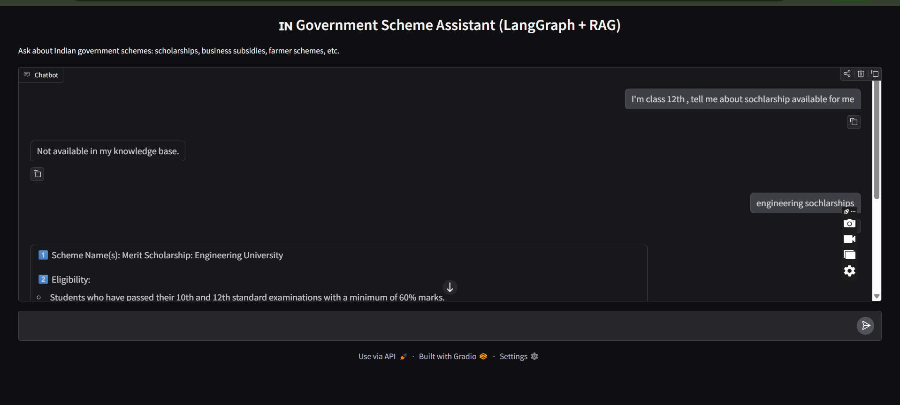
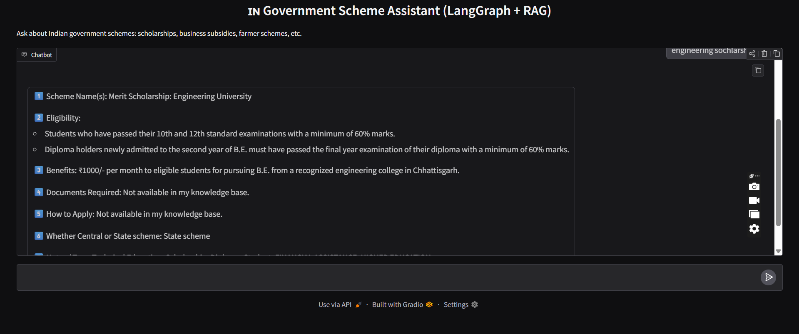

AI Government Scheme Recommendation System using LangGraph and RAG
Overview

This project focuses on developing an intelligent assistant capable of recommending relevant Government of India welfare schemes to users based on their background and requirements. Although the government offers a large number of schemes for farmers, students, entrepreneurs, women, and other categories, many people remain unaware of the benefits available to them due to scattered information and complex eligibility criteria.

To address this gap, this project uses a Retrieval-Augmented Generation (RAG) based AI system that utilizes a curated dataset of official schemes. Users can simply type their query in natural language, and the agent will search the dataset, analyze eligibility, and provide the most suitable scheme suggestions along with reference sources.

Objective

The main objectives of this project are:

To simplify access to government schemes for citizens.

To build a stateful LangGraph AI agent capable of multi-step reasoning.

To provide factual recommendations based on verified dataset information.

To demonstrate a practical and socially impactful use of AI technology.

Key Features

Government scheme recommendations based on user profile and query

Real information retrieval using FAISS vector database

Agent workflow controlled using LangGraph

Natural response generation with OpenAI GPT models

Gradio-based user interface for interaction

Dataset stored locally for data validity and transparency

System Architecture

Workflow of the model is defined using LangGraph, consisting of the following major steps:

User enters a query

Node 1: LLM analyzes the intent to determine user type (example: farmer, student)

Node 2: Relevant scheme descriptions retrieved from FAISS vectorstore

Node 3: LLM generates a simplified and useful response

Recommendation is displayed in the Gradio interface

This ensures that the output is grounded in real data and remains relevant to the user.

Technology Used
Component	Technology
Programming	Python
Agent Framework	LangGraph
RAG Framework	LangChain
Vector Search	FAISS
Embeddings	OpenAIEmbeddings
Language Model	OpenAI GPT (gpt-4o-mini)
Interface	Gradio
Dataset Format	CSV (Government Schemes)

